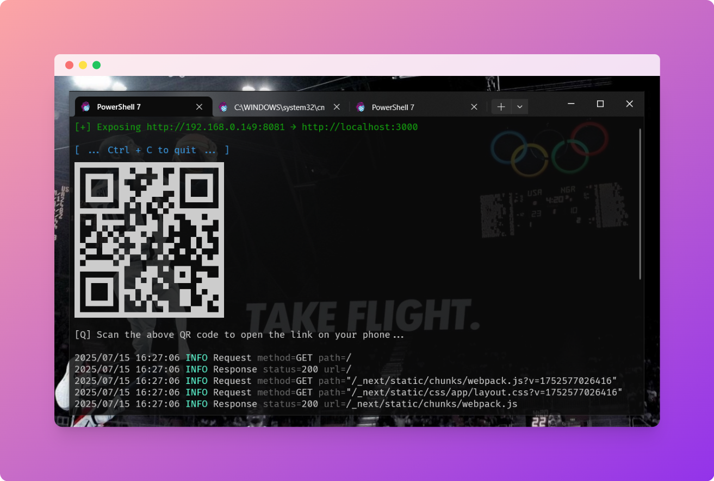

# ⚡ divo

**divo** is a lightweight reverse proxy for your local machine - like `ngrok`, but works entirely over your local Wi-Fi.

Use it to quickly expose a local web app to your phone or other devices on the same network. No internet, no signup, no server - just plug and play.

## ✨ Features

- 🔄 Reverse proxy to any local port (like `ngrok http 3000`)
- 🧠 Smart LAN IP detection
- 🖨️ Auto-generated QR code for easy access on mobile
- 🎨 Beautiful terminal output with colors
- ⚙️ Zero config - works out of the box
- 📦 Cross-platform binaries (Linux, macOS, Windows)

---

## 📸 Screenshot

Here's divo in action (with QR code and LAN URL)




---

## 🛠️ Installation

```bash
git clone https://github.com/yourusername/divo.git
cd divo
make build
```
Or download a binary from [Releases](https://github.com/r3yc0n1c/divo/releases).

## 🔧 Usage

```bash
divo http 3000
```

Optional: use environment variables for automation

```bash
TARGET_URL=http://localhost:3000 LISTEN_PORT=:9090 ./bin/divo
```

## 🔄 Cross Compilation
```bash
make cross
```

Generates:

- `bin/divo-linux-amd64`
- `bin/divo-windows-amd64.exe`
- `bin/divo-mac-amd64`

## 🧪 Tested On

- ✅ Windows 10, 11
- ✅ macOS Ventura
- ✅ Ubuntu 22.04


Works on any device connected to the same Wi-Fi 🌐

## 📄 License

**GPL-2.0** © 2025 [Raja Majumdar](https://github.com/r3yc0n1c)

> This project is licensed under the GNU General Public License v2.
> See [LICENSE](./LICENSE) for full terms.